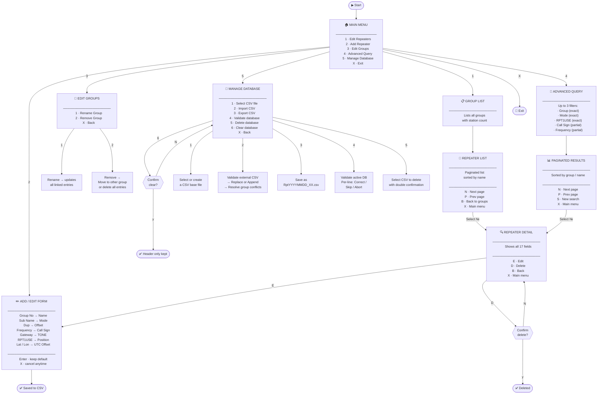

# ✨ ICOM DR List Manager

<div align="center">


**A utility for managing Digital Repeater (DR) lists compatible with any ICOM transceiver that has **DR mode****  
Manage • Validate • Import • Export • Delete                                                                                                

[Features](#features) • [Requirements](#requirements) • [Installation](#installation) • [CSV Format](#csv-format) • [Menu Structure](#menu-structure) • [Field Reference](#field-reference) • [Validation Rules](#validation-rules) • [Usage Tips](#usage-tips) • [Logging](#logging)

</div>

---

## Overview

Any ICOM transceiver equipped with **DR mode** (ID-31, ID-51, ID-52, ID-5100, IC-9700, and similar models) can load a structured repeater list through the respective **CS** programming software. `DR_list_manager.sh` provides a fully interactive, menu-driven TUI (Text User Interface) to build and maintain that list directly in the terminal — no GUI tools required. Entries are stored in a plain CSV file that can be exported and imported directly into the ICOM programming software. Designed for the Amateur Radio community, with locale-aware formatting can be easily applied in any scenario.

---

## Features

- **Interactive TUI** — dynamic headers and separators that adapt to any terminal width (up to 80 columns)
- **Three operating modes** — DV (D-Star), FM, and FM-N, each with mode-specific field logic
- **Group management** — organize repeaters into up to 50 named groups; rename or remove groups with automatic cascading updates
- **Full CRUD** — add, edit, and delete repeaters through guided prompts
- **Advanced search** — query the database using up to 3 combined filters (Group, Mode, RPT1USE, Call Sign, Frequency) with paginated results
- **Field validation** — per-field rules enforce correct callsigns, frequencies, offsets, CTCSS tones, and text length limits
- **Duplicate detection** — catches repeated entries (same group + name + frequency) before they cause issues in the radio
- **Callsign conflict detection** — prevents a DV callsign from being reused in any other mode, and blocks the same FM/FM-N callsign from appearing in the same band twice
- **Automatic corrections** — decimal separators (`.` → `,`), missing `Hz` suffix on tones, and mismatched offset values are fixed automatically during validation
- **CSV import with merge** — import an external CSV and choose to replace or append to the current database; group name conflicts are resolved interactively
- **Export with sequential naming** — exports are saved as `RptYYYYMMDD_XX.csv` with auto-incrementing sequence numbers
- **Database deletion** — safely delete CSV files from the file list with double-confirmation protection
- **Instance locking** — a PID-based lock file (`/tmp/dr_list_manager.lock`) prevents multiple simultaneous instances
- **Operation log** — all add, edit, delete, import, and export actions are timestamped in `dr_manager.log` with detailed correction records
- **Universal cancel** — press `X` at any prompt to abort the current operation and return to the previous menu
- **Colorized prompts** — default values highlighted in orange for quick visual reference
- **Locale-aware formatting** — uses `;` as the column separator and `,` as the decimal separator

---

## Requirements

| Dependency | Notes |
|---|---|
| Bash 4.0+ | Associative arrays required |
| `awk` | Field parsing and in-place updates |
| `grep` | Pattern matching |
| `sed` | Text substitution |
| `tput` | Terminal width/height detection |
| `mktemp` | Safe temporary file creation |
| `date` | Log timestamps and export filenames |

No external packages or internet access required. Runs entirely offline.

---

## Installation

```bash
# Clone the repository
git clone https://github.com/PP5KX/DR_List_Manager.git
cd DR_List_Manager

# Make the script executable
chmod +x DR_list_manager.sh

# Run
./DR_list_manager.sh
```

On startup, the script automatically loads `Repeater_list.csv` from the current directory if it exists. A different base file can be selected at runtime from the **Manage Database** menu (Option 5 → 1).

---

## CSV Format

> ⚠️ **Locale formatting — important**
>
> This application uses the following conventions, matching Brazilian system locale and the ICOM CS programming software behavior under `pt_BR`:
>
> - **Column separator:** `;` (semicolon)
> - **Decimal separator:** `,` (comma)
>
> Files using `.` (period) as a decimal separator or `,` (comma) as a column separator **will not parse correctly**. The validator can auto-correct period-based decimals during import.

### Column structure

The CSV contains **17 columns** in the following order:

| # | Column | Description | Example |
|---|---|---|---|
| 1 | `Group No` | Group number (1–50) | `4` |
| 2 | `Group Name` | Display name of the group (max 16 chars) | `Santa Catarina` |
| 3 | `Name` | Repeater display name (max 16 chars) | `Florianopolis` |
| 4 | `Sub Name` | Secondary label (max 8 chars) | `Centro` |
| 5 | `Repeater Call Sign` | Local repeater callsign (max 8 chars) | `PP5ZFP B` |
| 6 | `Gateway Call Sign` | D-Star gateway callsign (DV only, max 8 chars) | `PP5ZFP G` |
| 7 | `Frequency` | Receive frequency in MHz | `439,975000` |
| 8 | `Dup` | Duplex direction | `DUP-` |
| 9 | `Offset` | Frequency offset in MHz | `5,000000` |
| 10 | `Mode` | Operating mode | `DV` |
| 11 | `TONE` | Tone type | `OFF` |
| 12 | `Repeater Tone` | CTCSS tone with Hz suffix | `88,5Hz` |
| 13 | `RPT1USE` | Whether RPT1 slot is used | `YES` |
| 14 | `Position` | Coordinate precision level | `Approximate` |
| 15 | `Latitude` | Geographic latitude | `-27,597222` |
| 16 | `Longitude` | Geographic longitude | `-48,549167` |
| 17 | `UTC Offset` | Time zone offset | `-3:00` |

### Example rows

```
Group No;Group Name;Name;Sub Name;Repeater Call Sign;Gateway Call Sign;Frequency;Dup;Offset;Mode;TONE;Repeater Tone;RPT1USE;Position;Latitude;Longitude;UTC Offset
4;Santa Catarina;Florianopolis;Centro;PP5ZFP B;PP5ZFP G;439,975000;DUP-;5,000000;DV;OFF;88,5Hz;YES;Approximate;-27,597222;-48,549167;-3:00
4;Santa Catarina;Florianopolis;;PP5ZFP;;147,075000;DUP+;0,600000;FM;TSQL;88,5Hz;YES;Approximate;-27,597222;-48,549167;-3:00
5;Parana;Curitiba Simplex;;;;146,520000;OFF;0,000000;FM;OFF;88,5Hz;YES;None;0,000000;0,000000;-3:00
```

### Organizational conventions (Brazilian reference list)

The bundled `Repeater_list.csv` follows a geographic convention suited to Brazil, though the structure is flexible enough to be adapted to any country or region:

- **Group No / Group Name** — each group represents a Brazilian **state** (e.g. Group 4 = Santa Catarina, Group 5 = Paraná). For other regions, groups could represent countries, provinces, counties, or any other division.
- **Name** — identifies the **city** or locality where the repeater is located (e.g. `Florianopolis`, `Curitiba`).
- **Sub Name** — an 8-character secondary label. Use it to add context when a city has multiple repeaters of the same mode, to indicate a club callsign abbreviation, a site name, or any other distinguishing detail, (e.g. `Centro`, `Serra`, `146MHz`).

---

## Menu Structure

### Menu Map

The diagram below shows the full navigation structure of the application. Every branch can be cancelled at any prompt by pressing `X`.



### Main Menu


---

### Option 1 — Edit Repeaters *(List / Edit / Delete)*

Displays all groups with their station count. Selecting a group opens a paginated list of its repeaters, sorted alphabetically by name.


**Inside a group — repeater list:**


**Detail view of a selected repeater:**


---

### Option 2 — Add Repeater

A guided sequential form that collects all 17 fields for a new entry. The group name is auto-filled if the group number already exists in the database. For FM/FM-N modes, a numbered CTCSS tone table is displayed during the Repeater Tone selection step.

**Field entry flow for an analog repeater.**


**Field entry flow for a digital repeater.**


> The same form is reused for **editing** an existing repeater (reached from Option 1 → detail view → `[E]`), pre-populated with all current values.

---

### Option 3 — Edit Groups


- **Rename** — updates the group name across every repeater entry that belongs to that group.
- **Remove** — offers two options: move all repeaters in the group to another group (existing or new), or delete all of them permanently. Both paths create an automatic `.backup` file before modifying the database.

---

### Option 4 — Advanced Query

Allows filtering the entire database using up to **3 combined criteria**:


| Filter | Match type | Description |
|---|---|---|
| **Group** | Exact | Select from a numbered list of available groups |
| **Mode** | Exact | Choose DV, FM, or FM-N |
| **RPT1USE** | Exact | Choose YES or NO |
| **Call Sign** | Partial | Text search against the Repeater Call Sign field |
| **Frequency** | Partial | Text search against the Frequency field |

Results are sorted by group name then repeater name, displayed in a paginated table. Selecting an entry number opens the full detail view, from which the entry can also be edited or deleted directly.


---

### Option 5 — Manage Database


| Option | Description |
|---|---|
| **1 — Select CSV** | Switch the active database file. Lists all `.csv` files in the current directory. Can create a new empty base on the fly. |
| **2 — Import CSV** | Validate and import an external CSV. After validation, choose to **Replace** the current database or **Append** records to it. Group name conflicts between source and target are resolved interactively with [K]eep or [U]pdate options. |
| **3 — Export** | Save a copy of the current database as `RptYYYYMMDD_XX.csv`, where `XX` is an auto-incrementing sequence number to avoid overwriting previous exports from the same day. |
| **4 — Validate** | Run the full validation engine on the active database. Errors are shown line by line with the options to **Correct** interactively, **Skip** the offending line, or **Abort** the process. All automatic corrections are logged with details. |
| **5 — Delete** | List all available CSV files (excluding the currently active base). Select one to delete with a double-confirmation prompt. Prevents accidental deletion of the working database. |
| **6 — Clear** | Erase all records, retaining only the CSV header row. Requires explicit confirmation. Also removes backup files older than 7 days. |

---

## Field Reference

### Accepted values per field

| Field | Accepted values |
|---|---|
| `Group No` | Integer 1–50 |
| `Group Name` | Printable characters, max 16 chars |
| `Name` | Printable characters, max 16 chars |
| `Sub Name` | Printable characters, max 8 chars |
| `Repeater Call Sign` | Max 8 chars; DV requires exactly 8, last char A–Z; must be empty for simplex (`Dup=OFF`) |
| `Gateway Call Sign` | Exactly 8 chars, last char `G`, first 7 chars must match RPT1 call sign; required for DV duplex only |
| `Frequency` | Format `NNN,NNNNNN`; must fall within 144–148 MHz (VHF) or 430–450 MHz (UHF) |
| `Dup` | `OFF`, `DUP-`, `DUP+` |
| `Offset` | Format `N,NNNNNN`; must be `0,000000` when `Dup=OFF` |
| `Mode` | `DV`, `FM`, `FM-N` |
| `TONE` | `OFF`, `TONE`, `TSQL` — FM/FM-N only; must be `OFF` for DV |
| `Repeater Tone` | Standard CTCSS value with `Hz` suffix (e.g. `88,5Hz`); must be `88,5Hz` for DV entries |
| `RPT1USE` | `YES`, `NO` |
| `Position` | `None`, `Approximate`, `Exact` |
| `Latitude` | Format `-?NN,NNNNNN` (e.g. `-27,597222`) |
| `Longitude` | Format `-?NNN,NNNNNN` (e.g. `-48,549167`) |
| `UTC Offset` | Format `±HH:MM` or `--:--` (e.g. `-3:00`) |

### Supported CTCSS tones

The following 50 standard ICOM tones are accepted (Hz, comma-decimal):


---

## Validation Rules

The validation engine (shared by both the manual add/edit form and the CSV import process) enforces the following rules:

- **Frequency range** — only VHF (144–148 MHz) and UHF (430–450 MHz) amateur bands are accepted.
- **DV callsign exclusivity** — a callsign used as a DV repeater cannot appear under any other mode in the database, and vice versa.
- **FM/FM-N band exclusivity** — the same callsign cannot serve as a repeater in the same band (VHF or UHF) more than once; dual-band operation with the same callsign requires separate entries on different bands.
- **Duplicate entries** — records sharing the same Group No + Name + Frequency combination are flagged as duplicates.
- **Mode-field consistency** — DV entries must have `TONE=OFF` and `Repeater Tone=88,5Hz`; FM/FM-N entries must have a valid non-empty CTCSS tone.
- **Simplex entries** — both `Repeater Call Sign` and `Gateway Call Sign` must be empty when `Dup=OFF`.
- **Automatic silent corrections** — the following are fixed without user interaction: period-based decimal separators (`.` → `,`), missing `Hz` suffix on Repeater Tone values, and non-zero Offset values when Dup=OFF. All corrections are logged in `dr_manager.log` with line-by-line details.

---

## Usage Tips

- **Cancel anywhere** — press `X` at any prompt (including mid-form) to abort cleanly and return to the previous menu without saving partial data.
- **Accept defaults** — press `Enter` at any prompt to keep the value shown in orange brackets.
- **Automatic backup** — a `.backup` file is created automatically before any destructive operation (delete repeater, remove group, switch database).
- **Export before bulk changes** — use Option 5 → 3 to save a timestamped snapshot before making large edits.
- **Locale in spreadsheet apps** — when opening the CSV in LibreOffice Calc or Excel, configure the import dialog for `;` as the column delimiter and `,` as the decimal separator to avoid data corruption.
- **ICOM programming software** — import the exported CSV through the CS software (CS-51, CS-52, CS-5100, etc.) using the memory channel CSV import function.
- **The `;` character is forbidden** in all text fields and will be rejected with an error at entry time.
- **Single instance** — the script uses a PID lock file at `/tmp/dr_list_manager.lock`. If a previous session crashed and left a stale lock, the script detects and removes it automatically on next launch.
- **Database deletion** — use Option 5 → 5 to safely remove old or unused CSV files. The currently active database cannot be deleted; switch to another base first if needed.

---

## Logging

All significant operations are appended to `dr_manager.log` in the script's working directory:


Logged event types: `START`, `END`, `ADD`, `EDIT`, `DELETE`, `DELETE_GROUP`, `DELETE_BASE`, `RENAME_GROUP`, `MOVE_GROUP`, `BASE_SELECT`, `IMPORT`, `EXPORT`, `CLEANUP`, `IMPORT_AUTO_CORRECTION_LINE_*`, `IMPORT_VALIDATION_IGNORED`, `IMPORT_VALIDATION_CORRECTED`, `IMPORT_VALIDATION_SUMMARY`.

---

## Versioning

This project follows **semantic versioning**:

- **Decimal increments** (e.g. `3.6` → `3.7`) — bug fixes, minor UX improvements, or small feature additions.
- **Whole-number increments** (e.g. `3.x` → `4.0`) — significant new features or structural changes.
- **Language suffix** (e.g. `3.7_en`) — indicates English localization version.

The current version (**3.8_en**) is displayed in the application header on every startup.

---

## License

This project is released under the **MIT License**. See [`LICENSE`](LICENSE) for details.

---

## Author

Developed by **Daniel — PP5KX**  
Amateur radio operator based in Mafra, Santa Catarina, Brazil  
🌐 [pp5kx.net](https://pp5kx.net) · [dvbr.net](https://dvbr.net)

Part of the [dvbr.net](https://dvbr.net) open infrastructure project for the Brazilian amateur radio community.

*73 de PP5KX*
